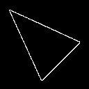
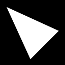
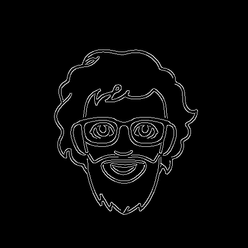
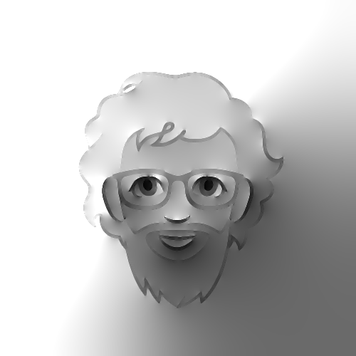
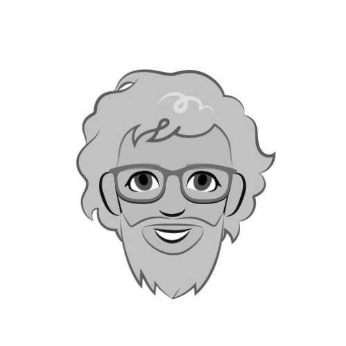
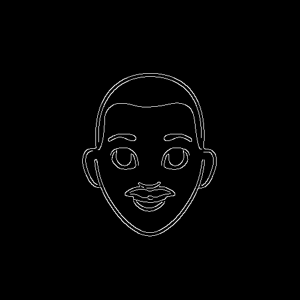
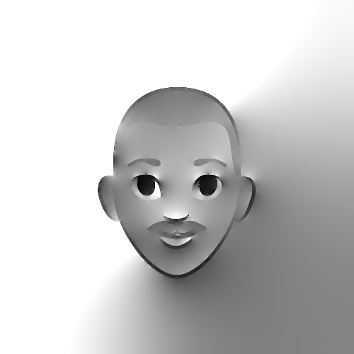

# Inpainting with Osmosis

An OpenCV, C++-based implementation of the Linear Osmosis model for compact grey scale image representation. An approximation is reconstructed from the drift vectors specified only at the edges of an image. The reconstructions show that this model has great potential to compress cartoon-like images.

#   Osmosis for Compact Data Representation
* Consider a positive reference image $v: \Omega \to \mathbb{R}_+$, with average grey value $\mu_v$.
* Let $M = \Omega_b$ be an edge mask of $v$ computed via standard edge detectors (e.g. Canny).
* We can find an approximation $w$ of the reference image $v$ by defining drift vector $\mathbb{d}$, only on $\Omega_b$ as
```math
	\mathbf{d} = \left\{
	\begin{array}{ll}
	 \dfrac{\nabla v(x)}{v(x)} & x \in \Omega_b, \\
	0 & x \in  \Omega \setminus \Omega_b
	\end{array}
	\right.
```
* The linear osmosis evolution,
    $$\partial_t u = \mathbf{div} \ (\nabla u - \mathbf{d}u)$$ 
with homogeneous Neumann boundary conditions on $\partial \Omega$ and with initial condition, $u(x,0) = f(x)$ on $\Omega$, converges to $w$. 
			
# Prerequisites
To run this implementation on a Linux based machine, the following are required:
* [OpenCV](https://docs.opencv.org/4.x/d7/d9f/tutorial_linux_install.html) for C++
* [PETSc](https://petsc.org/release/) for g++ compiler
		
# Usage

To build the repository, you can just use the makefile provided. Make sure to update the PETSC_DIR in the makefile based on your installation, and then

```
>> make
>> ./main actual_image.pgm edge_mask.pgm tau max_epochs
```
A few samples and edges of cartoon images from Google's [Cartoon Set](https://google.github.io/cartoonset/) is available in the res folder. It can be run in this manner

```
>> ./main res/cs3953295079307621109.pgm  res/e3958423195682907586.pgm 100000 5
```

The reconstructed image is available as output/output.pgm.

# Experiments

| Edge Mask  | Reconstructed Image via Linear Osmosis| Original Image |
| ----------- | ----------- |-------|
| | |   
|    | |
|    | |


# References

[1] J. Weickert, K. Hagenburg, M. Breuß, O. Vogel, Linear osmosis models for visual computing, in:
A. Heyden, F. Kahl, C. Olsson, M. Oskarsson, X.-C. Tai (Eds.), Energy Minimization Methods
in Computer Vision and Pattern Recognition, Springer Berlin Heidelberg, Berlin, Heidelberg,
2013, pp. 26–39.

[2] O. Vogel, K. Hagenburg, J. Weickert, S. Setzer, A fully discrete theory for linear osmosis
filtering, in: A. Kuijper, K. Bredies, T. Pock, H. Bischof (Eds.), Scale Space and Variational
Methods in Computer Vision, Springer Berlin Heidelberg, Berlin, Heidelberg, 2013, pp. 368–379.


